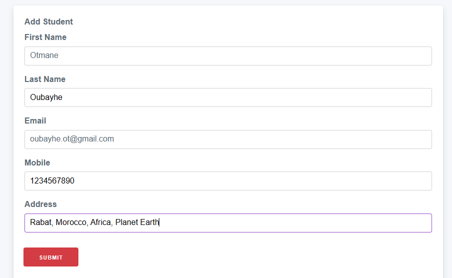
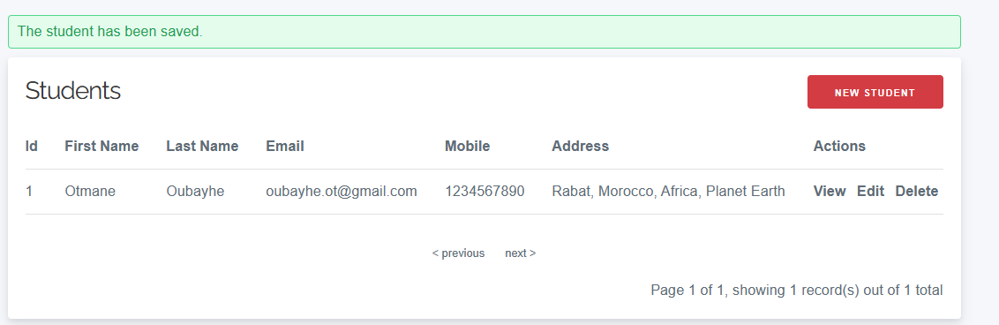
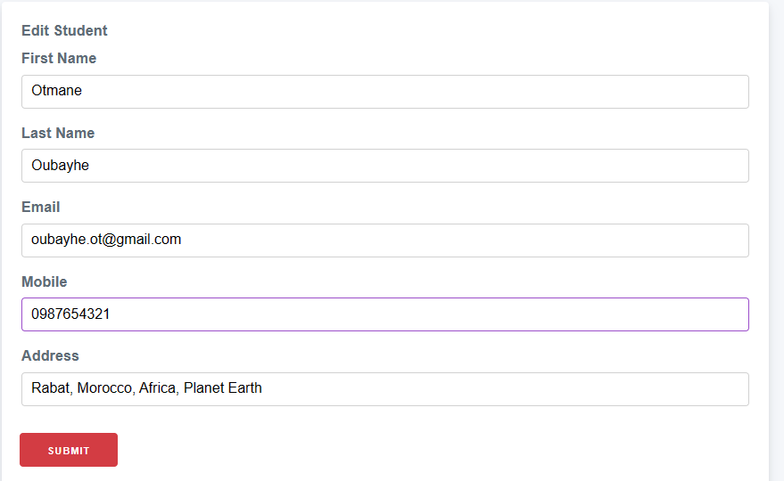
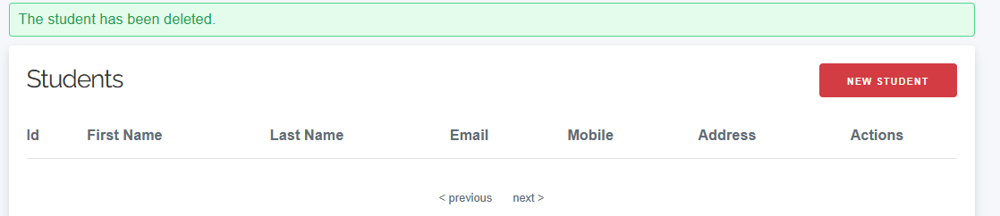

# Quick Start CakePHP
- Before starting make sure you have php installed by entering this in your terminal
```
php -v
```
- Also in my case I'm using XAMP.
- All the commands that we're going to be using are preferred to be implemented in the same directory.
## 1. Install Composer:
To install, just enter these commands in the terminal:
```
php -r "copy('https://getcomposer.org/installer', 'composer-setup.php');"
php -r "if (hash_file('sha384', 'composer-setup.php') === 'dac665fdc30fdd8ec78b38b9800061b4150413ff2e3b6f88543c636f7cd84f6db9189d43a81e5503cda447da73c7e5b6') { echo 'Installer verified'; } else { echo 'Installer corrupt'; unlink('composer-setup.php'); } echo PHP_EOL;"
php composer-setup.php
php -r "unlink('composer-setup.php');"
```
## 2. Enable extension:
In your php.ini file *(C:\php-8.3.2\php.ini)* you should uncomment **extension=php_intl.dll (or extension=intl)**
## 3. Create a CakePHP project:
Enter this command into the terminal, with my_app_name being the name you want to give for this project:
```
php composer.phar create-project --prefer-dist cakephp/app:5.* my_app_name

```
> [!IMPORTANT]
> If you had problem creating the app, you most likely have to uncomment **extension=php_intl.dll (or extension=intl)** in **C:\xampp\php\php.ini** as well.
## 4. View the created project:
* Enter to the created project directory:
```
cd my_app_name
```
* Run the project:
```
bin/cake server
```
* copy the built-in server link (example:http://localhost:8765/)
> [!IMPORTANT]
> You might face this Error message: **Database driver `Cake\Database\Driver\Sqlite` cannot be used due to a missing PHP extension or unmet dependency. Requested by connection  `test`**.
> to solve it, you need to go to php.ini, and uncomment **extension=pdo_sqlite**
## 5. Connect to the database:
* Create a database in your phpMyAdmin
* In you project folder go to **config/app_local.php** and set the username, password and database to thier actual values.

# Simple CRUD App using CakaPHP - Students Management System:
We're going to build a very simple crud app using CakePHP. The app is a Student management system, it will be able to add new student, delete, edit and display.
## 1. Create the student table:
The student table has this columns:
    - id: int & auto_incremented 
    - first_name: varchar(55)
    - last_name: varchar(55)
    - email: varchar(55)
    - mobile: varchar(55)
    - address: varchar(55)

## Bake All:
Here is to create the template, model and controller of the Student table. All you need to do is:
```
bin/server bake all
```
then:
```
bin/server bake all Students
```
Once you do that, you automaticaly created all the necessary files (Controllers, views, tests...).
To use the app, you can run it again using 
```
bin/cake server
```
and with the built-in server link, you can add */students* and operate the CRUD Functions on the student model.
Here is an example of Creating, Getting/Reading, Updating/Editing and Deleting a student:
* Add a Student:

* View All Students:

* Edit student (the mobile number):

* Delete student:
